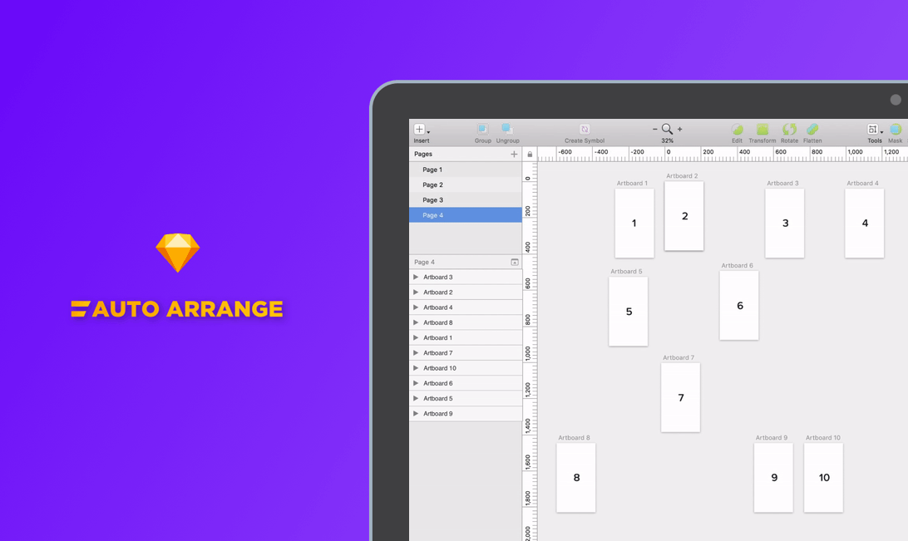

# Auto Arrange- The Sketch Plugin

## The Problem
I am a Sketch power user. Being an interaction designer, I need to design the whole workflow in Sketch. This means that I copy and move a lot of Artboards around to reuse the design elements.
Anyone familiar with Sketch must know that there are two ways to identify the artboards:
1. Left-hand side Layer List.
2. Right-hand side Canvas.
Naturally, while ordering the artboards, I visually arrange it on the canvas. But, the artboard order in the layer-list has no connection to the order on the canvas. This disconnect is pretty unintuitive.

## Why do I need this connection?
While working with different stakeholders, I frequently share my designs and workflows with a lot of people. I mostly do it using PDFs and recently through this application called Abstract. While exporting a PDF from Sketch or while uploading it on Abstract, it takes the artboard order in the layer-list as the export order.
But, while designing the screens, my natural mental model is to visually arrange the artboards in their correct order on the canvas. When most of my designs have around 30–40 artboards, manually arranging each and every artboard correctly is quite a task.

## Is it only my problem?
I spoke to 4 designers on my team here at Nutanix and all of them face the same problem while sharing their designs. Each one of them has their own method to correctly arrange the artboard order before sharing their designs.
Keeping all of this in mind, I felt that there should be a simple way to solve this problem. And what can be simpler than a plugin inside sketch which does this tedious job for you!

## The Solution
The Sketch plugin arranges the artboard order in the layer-list based on their position(x,y) on the canvas. The artboard order can be arranged from left to right or from top to bottom.

## The Future
1. The plugin takes around a minute to arrange the artboards if the Sketch file is large. I am trying to make it faster.
   **Update: I found the issues that were making the plugin slow and now the plugin works well for Sketch files of any size.**
2. I am working on adding the functionality to automatically rename the artboards according to their position in the canvas.
